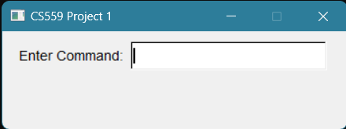

# TGA圖像編輯程式

這是電腦圖學導論的第一個Project，用來編輯TGA格式的圖片。

# How to Build

> 該程式只能在x64 Windows + MSVC環境編譯

1. 以Visual Studio開啟CMakeLists.txt
2. 設定組態（建議x64-Release）後，點擊上方的綠色鍵號
 

# How to Use

開啟程式後會有一個輸入框可以輸入指令，如：

- `load <圖片檔>`： 載入圖片
- `gray`： 變成灰階

更多的指令寫在`上課教材/Project 1 An Image Editing Program.pdf`的「Details on Things to Implement」章節。